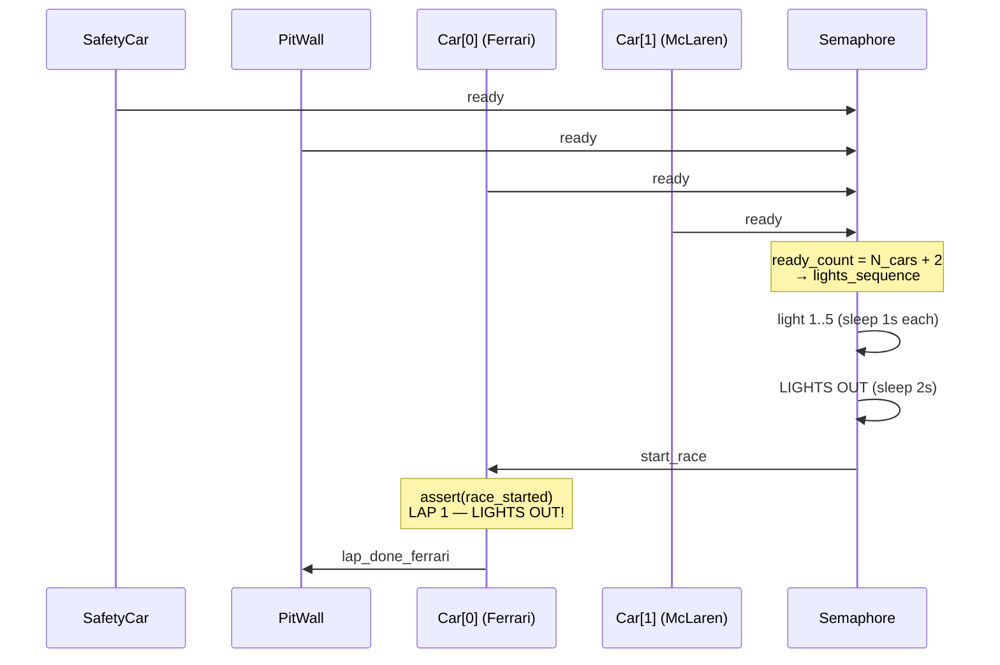
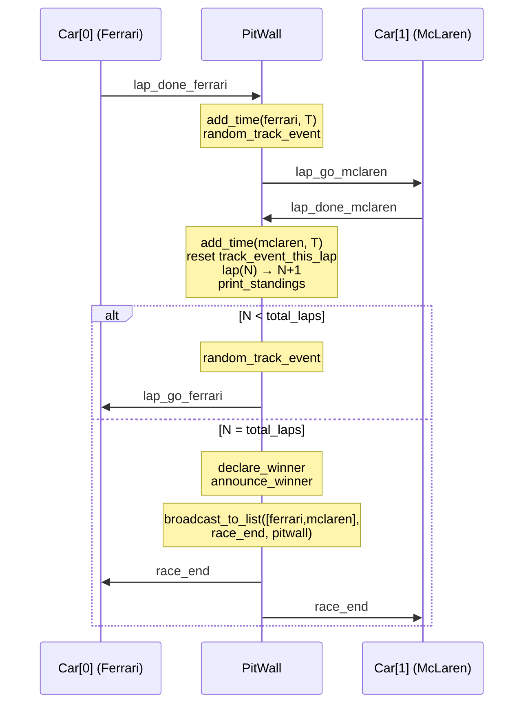
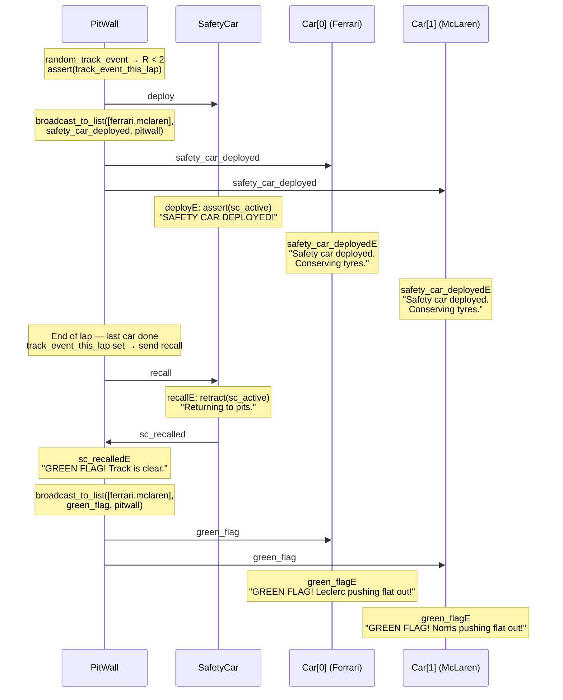
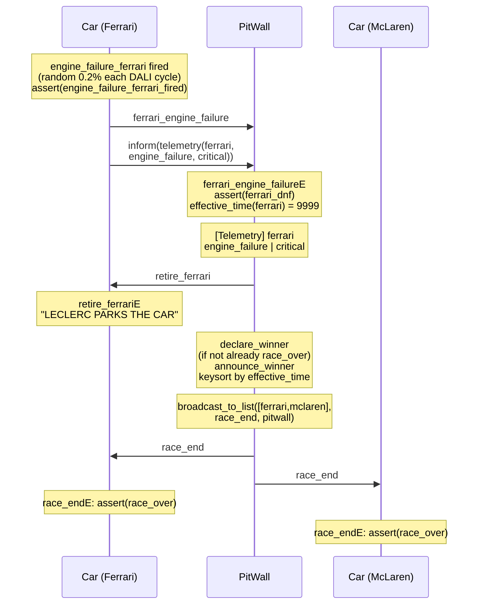
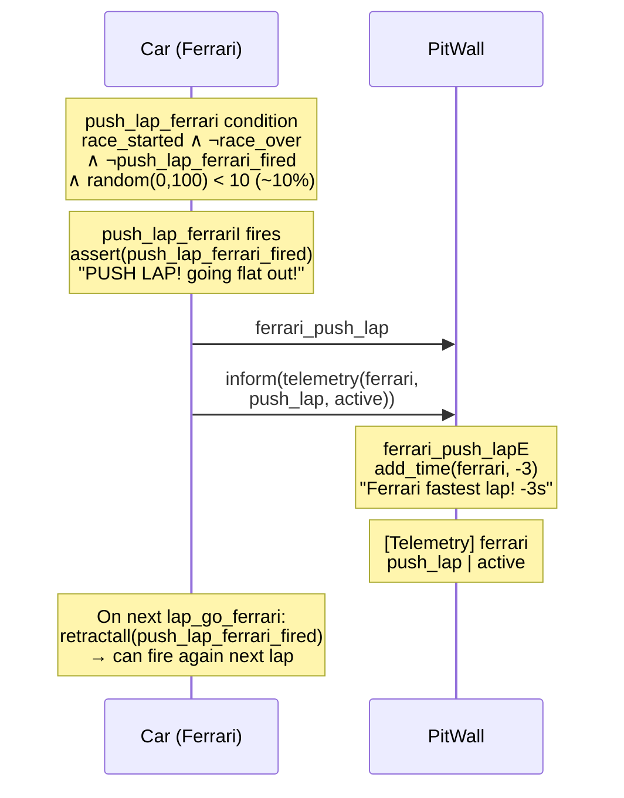

# F1 Race — DALI Multi-Agent Simulation

A Formula 1 race simulation built with the **DALI Multi-Agent System** framework.  
Car agents are **dynamically generated** from a single `agents.json` config file — no hardcoded agents in the codebase.  
The **Pit Wall** coordinates the race flow and generates **probabilistic events** (safety car, rain) automatically.

> For full documentation see [`docs/latex/`](docs/latex/).

---

## Project Structure

```
f1_race/
├── agents.json          # ← Single source of truth for all car agents
├── generate_agents.py   # ← Generates DALI files from agents.json
├── startmas.sh          # Launch script (calls generate_agents.py, then starts MAS)
├── docker-compose.yml   # Docker Compose (mas + ui containers)
├── .env.example         # Template for SICSTUS_PATH
├── .dockerignore
├── patch/
│   ├── apply_dali_wi.sh       # Patches upstream DALI files at runtime
│   ├── active_server_wi.pl    # Patched server file
│   └── active_user_wi.pl      # Patched user-agent file
├── docker/
│   ├── setup.sh         # Auto-detects SICStus, writes .env
│   ├── mas/Dockerfile
│   └── ui/Dockerfile
├── ui/
│   ├── dashboard.py     # Flask backend — reads agents.json dynamically each request
│   ├── static/
│   │   ├── app.js       # Frontend — syncConfig() auto-detects agent changes every 5s
│   │   └── index.html
│   ├── run.sh           # Creates venv + launches dashboard (stamp-based pip skip)
│   └── requirements.txt
├── mas/
│   ├── instances/
│   │   ├── semaphore.txt      # fixed
│   │   ├── pitwall.txt        # fixed
│   │   ├── safety_car.txt     # fixed
│   │   └── {id}.txt           # generated per car
│   └── types/
│       ├── semaphoreType.txt  # generated (waits N_cars + 2 ready)
│       ├── pitWallType.txt    # generated (round-robin over N cars)
│       ├── safetyCarType.txt  # generated
│       └── {id}Car.txt        # generated per car
├── conf/
│   ├── communication.con
│   ├── makeconf.sh / .bat
│   └── startagent.sh / .bat
├── build/               # Runtime (auto-generated)
├── work/                # Runtime (auto-generated)
└── log/                 # Runtime (auto-generated)
```

---

## Agents

| Agent | Type | Role |
|-------|------|------|
| `semaphore` | `semaphoreType` | Collects `ready` signals, runs F1 lights sequence, fires `start_race` |
| *(car agents)* | `{id}Car` | Generated from `agents.json`; run laps and react to track events |
| `pitwall` | `pitWallType` | Race coordinator: lap dispatch, timing, random track events |
| `safety_car` | `safetyCarType` | Deploys/recalls on PitWall command, triggers green-flag chain |

### Default car roster (`agents.json`)

| ID | Team | Driver | Car |
|----|------|--------|-----|
| `ferrari` | Ferrari | Leclerc | SF-24 |
| `mclaren` | McLaren | Norris | MCL38 |


> Add or remove cars by editing `agents.json` only — everything else is generated automatically.

### Agent Event Reference

**CarAgent** (one per car, e.g. `ferrariCar`)

| Name | Description |
|------|-------------|
| *Knowledge base* | |
| `race_started` | Set on lights-out; gates all lap and event handlers |
| `race_over` | Set on `race_endE`; silences all guarded handlers |
| `engine_failure_{id}_fired` | One-shot flag; prevents engine-failure from firing twice |
| `push_lap_{id}_fired` | Per-lap flag; retracted by `lap_go_{id}E` each lap |
| *External events* | |
| `start_raceE` | Lights-out from semaphore; asserts `race_started`, sends `lap_done_{id}` |
| `lap_go_{id}E` | Pit wall starts a new lap; resets push-lap flag, sends `lap_done_{id}` |
| `box_{id}E` | Pit-stop request; sends `pit_done_{id}` (+25s penalty) |
| `rain_warningE` | Heavy-rain notification (cosmetic, guarded by `race_over`) |
| `safety_car_deployedE` | Safety-car deployment notification (cosmetic, guarded by `race_over`) |
| `green_flagE` | Safety-car recalled; car acknowledges green flag (guarded by `race_over`) |
| `retire_{id}E` | DNF confirmation from pit wall; car parks |
| `race_endE` | Race-over broadcast; asserts `race_over` |
| *Internal events* | |
| `engine_failure_{id}I` | ~0.2%/cycle; fires once per race; notifies pit wall of DNF; sends `inform(telemetry({id}, engine_failure, critical))` |
| `push_lap_{id}I` | ~10%/cycle; fires once per lap; deducts 3s via pit wall; sends `inform(telemetry({id}, push_lap, active))` |

**PitWallAgent**

| Name | Description |
|------|-------------|
| *Knowledge base* | |
| `{id}_time/1` | Accumulated race time per car (seconds) |
| `{id}_dnf/0` | Asserted on engine failure; makes `effective_time` return 9999 |
| `lap/1` | Current completed-lap counter; starts at 0 |
| `race_over/0` | Asserted by `declare_winner`; gates all handlers |
| `track_event_this_lap/0` | One-shot flag; prevents multiple track events per lap |
| *External events* | |
| `lap_done_{id}E` | Adds lap time, rolls track event, dispatches to next car |
| `pit_done_{id}E` | Adds +25s, dispatches to next car |
| `sc_recalledE` | Safety car recalled; broadcasts `green_flag` to all cars via `broadcast_to_list` |
| `{id}_engine_failureE` | Asserts DNF, retires car, triggers `declare_winner` |
| `{id}_push_lapE` | Subtracts 3s from the car's accumulator |

**SemaphoreAgent**

| Name | Description |
|------|-------------|
| *Knowledge base* | |
| `ready_count/1` | Running count of `ready` signals received; initialised to 0 |
| *External events* | |
| `readyE` | Increments the counter; fires `lights_sequence` when threshold is reached |

**SafetyCarAgent**

| Name | Description |
|------|-------------|
| *Knowledge base* | |
| `sc_active/0` | Present while the safety car is deployed; absent otherwise |
| *External events* | |
| `deployE` | Asserts `sc_active`; idempotent if already deployed |
| `recallE` | Retracts `sc_active`, sends `sc_recalled` to pit wall |

---

## Dynamic Agent System

Car agents are **not hardcoded** anywhere. `generate_agents.py` reads `agents.json` and generates all DALI files at each startup:
```
agents.json
    └──> generate_agents.py
              ├── mas/instances/{id}.txt
              ├── mas/types/{id}Car.txt
              ├── mas/types/pitWallType.txt
              ├── mas/types/semaphoreType.txt
              └── mas/types/safetyCarType.txt
```

| Situation | Behaviour |
|-----------|-----------|
| `agents.json` unchanged | Skips — no files written |
| New car added | Full regeneration |
| Car removed | Stale files deleted, then full regeneration |
| `--force` flag | Always regenerates |

To add a car, add an entry to `agents.json` and run `bash startmas.sh`:

```json
{ 
    "id": "myclubcar", 
    "team": "My Club", 
    "car_model": "X1", 
    "driver": "Rossi",
    "label": "Club X1", 
    "color": "#001020", 
    "border": "#00aaff" 
}
```

---

## Race Flow

### Startup Sequence

1. Every agent (all cars, pit wall, safety car) sends a `ready` message to the semaphore.
2. The semaphore waits until it has collected exactly N_cars + 2 ready signals.
3. The semaphore runs the F1 lights sequence (5 lights on, 1s each; 2s pause; lights out) and sends `start_race` to Car[0].

### Lap Round-Robin

Once the race starts, laps proceed in a strict round-robin over the ordered car list:

1. `Car[i]` receives `lap_go_{id}` from the pit wall.
2. `Car[i]` sends `lap_done_{id}` to the pit wall.
3. The pit wall adds a random lap time, optionally fires a track event, and sends `lap_go_{id+1}` to the next car.
4. After the last car of a lap completes: lap counter increments, standings printed. If laps remain: `random_track_event` is rolled, then `lap_go` is sent to Car[0]. If race complete: `declare_winner` is called and `race_end` is broadcast to all cars via `broadcast_to_list`.

At any point a car's internal events (`engine_failureI`, `push_lapI`) can fire autonomously.

---

## Sequence Diagrams

### 1 — Startup



### 2 — Lap Round-Robin



### 3 — Safety Car: Deploy, Recall, Green Flag Chain



### 4 — Engine Failure / DNF



### 5 — Push Lap (Internal Event)



---

## Timing

Lower total accumulated time wins.

| Event | Time change |
|---|---|
| Each lap | `+ random(60..90)` s |
| Pit stop | `+ 25s` |
| Safety car (20% chance/lap) | `+ 10s` all cars |
| Heavy rain (20% chance/lap) | `+ 5s` all cars |
| Push lap (~10% chance, internal event) | `- 3s` |
| Engine failure / DNF (~0.2% chance, internal event) | `time = 9999s` → race ends |

---

> For installation and setup instructions, see [SETUP.md](SETUP.md).

---

## Dashboard Features

| UI element | Function |
|---|---|
| **&#8635; Restart MAS** | Kills SICStus + tmux session, reruns `startmas.sh` |
| **⚠ Deploy SC** | Sends deploy message to safety car immediately |
| **✓ Recall SC** | Recalls the safety car |
| **Agent: / Command:** bar | Send any arbitrary Prolog command to any agent pane |
| ↓ pin button | Toggle auto-scroll for that pane |
| ✕ button | Clear pane output |
| − button | Minimize pane to tray |

---

## Patch System

The F1 example requires fixes to three upstream DALI framework files (`active_server_wi.pl`, `active_user_wi.pl`, `active_dali_wi.pl`) for dynamic port selection and address propagation. Rather than modifying the upstream files, `patch/apply_dali_wi.sh` patches them **automatically at every MAS startup** — no permanent changes in the repository.

---

## DALI Syntax Reference (used in this project)

| Syntax | Meaning | Example |
|--------|---------|---------|
| `nameE:> Body.` | React to external event `name` | `start_raceE:> write('Go!').` |
| `nameI:> Body.` | Fire internal event when condition `name` holds | `push_lap_ferrariI:> send_m(pitwall, ...).` |
| `name :- Cond.` | Condition for internal event `nameI` | `push_lap_ferrari :- race_started, \+ race_over, ...` |
| `messageA(agent, msg)` | Send a message (top-level clause only) | `messageA(pitwall, send_message(lap_done_ferrari, ferrari)).` |
| `send_m(agent, msg)` | Send a message (safe inside `if/3`) | `send_m(safety_car, send_message(deploy, pitwall)).` |
| `random(Low, High, R)` | Random integer `Low =< R < High` | `random(0, 10, R).` |
| `if(Cond, Then, Else)` | Conditional | `if(R < 5, send_m(...), true).` |
| `\+ Goal` | Negation-as-failure | `\+ race_over` |
| `broadcast_to_list(Targets, Event, Sender)` | Send the same event to a list of agents (defined in `communication.con`) | `broadcast_to_list([ferrari,mclaren], race_end, pitwall).` |
| `inform(telemetry(Car, Data, Level))` | FIPA inform with telemetry payload, priority 100, logged by pit wall | `send_m(pitwall, inform(telemetry(ferrari, push_lap, active), ferrari)).` |
| `:- Goal.` | Directive (runs at load time) | `:- write('Agent ready!').` |
| `keysort(+Pairs, -Sorted)` | Sort list of `Key-Value` pairs by key | `keysort([3-b, 1-a], S).` |
